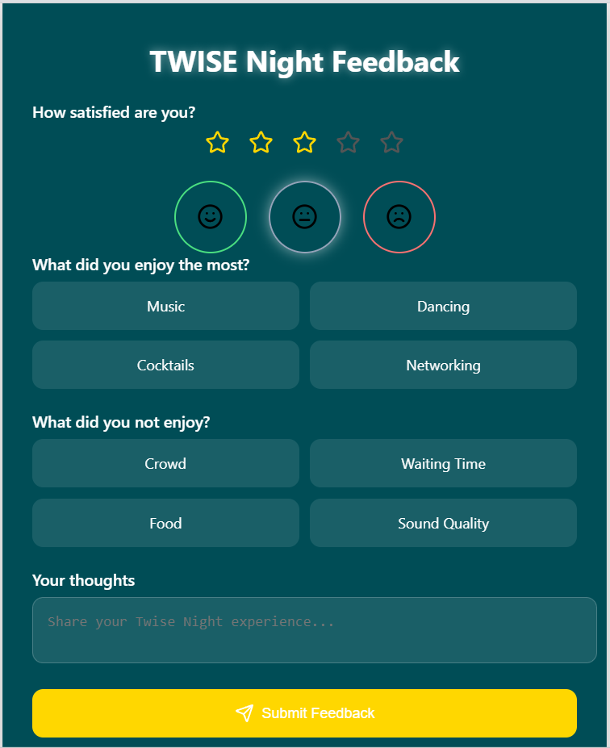

# -Live-Impact
# 🎯 Live Impact – IA pour l’Évaluation Instantanée de la Nuit des Chercheurs

## 🧠 Objectif du Projet

**Live Impact** est une solution d’intelligence artificielle conçue pour évaluer **en temps réel** l’expérience des participants à la **Nuit des Chercheurs**.  
Le système exploite des retours numériques (questionnaires, QR codes, formulaires mobiles) pour analyser :

- ✅ Le niveau de satisfaction  
- 💡 L’intérêt scientifique des activités  
- 😊 Les émotions et sentiments (positif, neutre, négatif)

L’objectif est d’offrir un **aperçu immédiat** de l'événement afin d’améliorer l’engagement et d’ajuster les activités en temps réel.

---

## 📋 Contexte et Défi

Le projet répond à un besoin croissant de **feedback intelligent en événementiel scientifique** :  
- Collecte automatique via QR codes/formulaires  
- Analyse sémantique et émotionnelle des réponses  
- Visualisation immédiate et actionnable

---

## 📊 Fonctionnalités Clés

- 📥 Collecte multicanal (QR code, formulaires mobiles)
- 🧠 Analyse de sentiment (NLP)
- 📈 Tableau de bord interactif en temps réel
- 💬 Recommandations d’amélioration basées sur les retours
- 🔍 Indicateurs clés :
  - Taux de satisfaction général
  - Activités les plus appréciées
  - Sentiment global (positif/neutre/négatif)

---

## 🧰 Technologies Utilisées

- **Frontend** : React.js  
- **Backend** : Flask  
- **IA & NLP** : Python, TextBlob 
- **Visualisation** : Chart.js, Plotly, Dash  
- **Base de données** : firebase

---

## 📁 Lien Drive 

📎 [Accéder au dossier Drive](https://drive.google.com/drive/folders/1JSurqnRx9FtPJ8pue6NoWW9nG4J53jvf)

---

